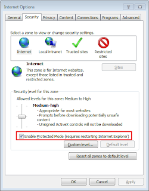
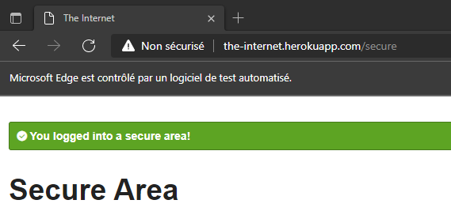
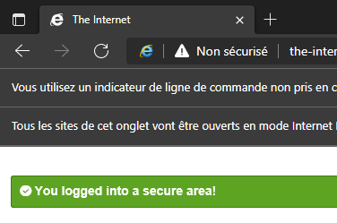

# Selenium tests on Edge in IE mode

## Docs

[New testing tools to help prepare for IE retirement](https://techcommunity.microsoft.com/t5/windows-it-pro-blog/new-testing-tools-to-help-prepare-for-ie-retirement/ba-p/3059947#:~:text=With%20IE11%20retirement%20fast%20approaching%2C%20Microsoft%20has%20collaborated,and%20apply%20them%20for%20testing%20in%20IE%20mode.)

[User Internet Explorer Driver to automate IE mode in Microsoft Edge](https://docs.microsoft.com/fr-fr/microsoft-edge/webdriver-chromium/ie-mode?tabs=c-sharp)

## Required

* Selenium 4 or higher 
* IE Driver Server 4.0.0 or higher - for IE compability mode
* (optionnal) MS Edge driver  - fore "pure" Edge tests

On Internet Explorer 7 or higher on Windows Vista or Windows 7, you must set the Protected Mode settings for each zone to be the same value. The value can be on or off, as long as it is the same for every zone. To set the Protected Mode settings you have to choose "Internet Options" from the "Tools" menu and then click on the Security tab. For each zone, there will be a check box at the bottom of the tab labeled Enable Protected Mode.

## Content
`IEDriverServer` and `msedgedriver` are already setup in `test/resources`

* `classicMode` execute the test in edge using msedgedriver, the classic way.
  
* `iemode` execute the test in edge with ie mode activated, using IEDriverServer.
  
